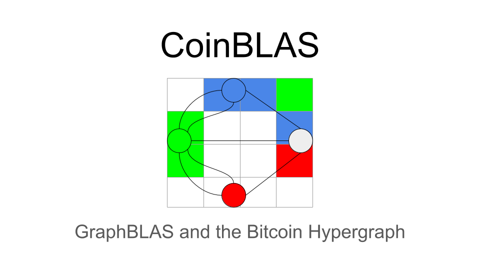
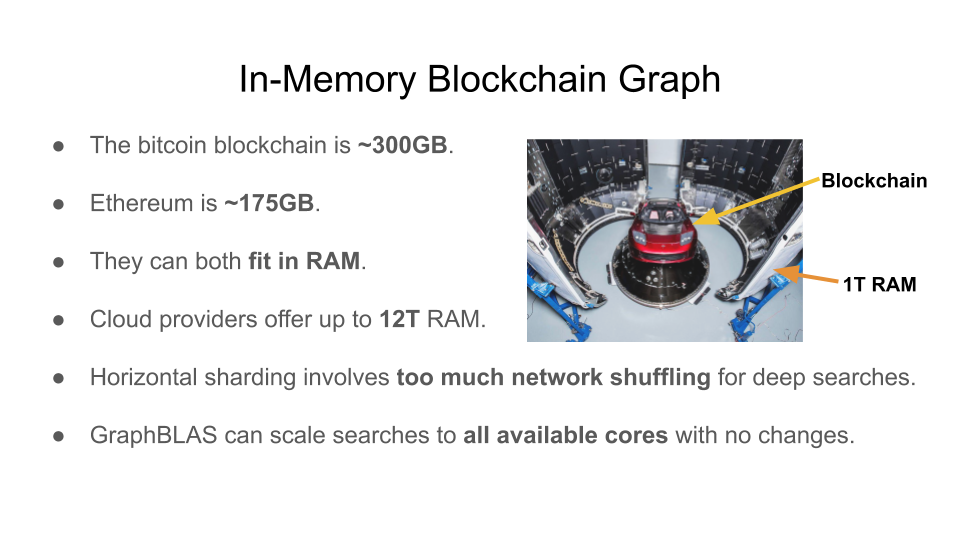
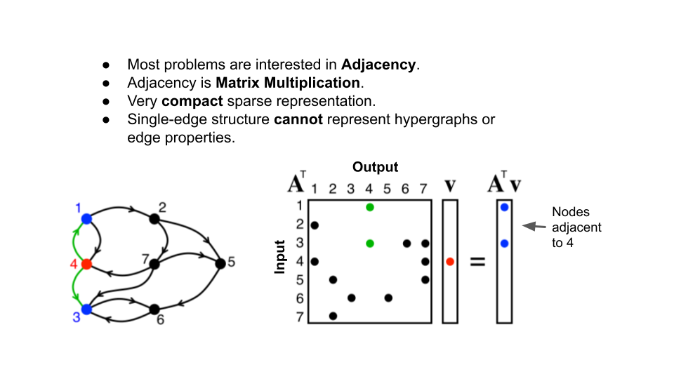
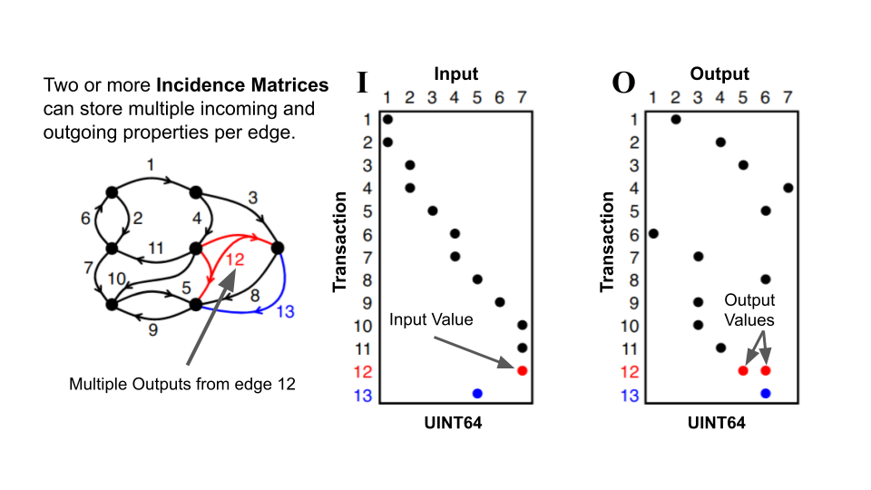
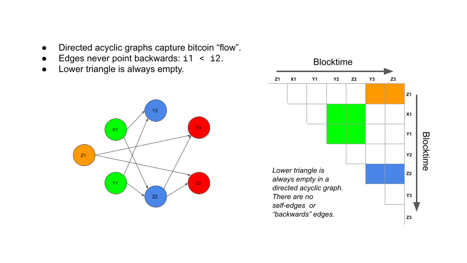
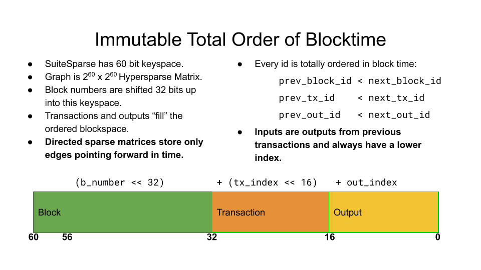
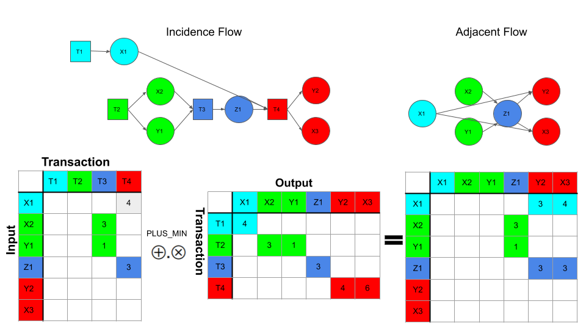
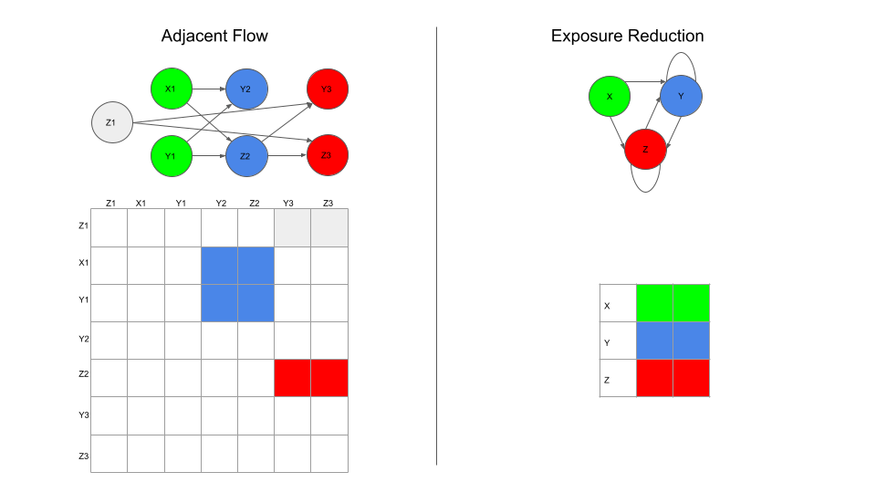

Bitcoin present a particularly stubborn graph analysis problem:
transactions can have many inputs and outputs, all of which can be
created at will by the network's users forming a very large sparse
[Hypergraph](https://en.wikipedia.org/wiki/Hypergraph).

The Bitcoin hypergraph has extremely high [Graph
Diameter](https://en.wikipedia.org/wiki/Distance_(graph_theory)) that
likely approaches the number of blocks in the chain.  Value can flow
forward in time through many, many transactions on its way from one
address to another, and each transaction along the way can branch into
many sub-paths.  Starting from one output and traversing the graph
explodes the number of nodes visited in order to search across the
blockchain.

**Graphegon CoinBLAS Community Edition** is a Graph [Linear
Algebra](https://en.wikipedia.org/wiki/Linear_algebra) analysis
platform for bitcoin that uses the [GraphBLAS](https://graphblas.org)
graph API as a foundation for analyzing and solving graph problems
over the bitcoin hypergraph. If you have enough RAM, Google BigQuery
budget, cores and time you can load all of bitcoin history into
in-memory graphs and do full-graph, full-flow analysis using simple,
high level algebraic syntax.

Loading the full blockchain graph takes up to 512GB of memory and
$1000 worth of BigQuery cost, so that's probably out of most people's
budgets.  However CoinBLAS can load a month's worth of graph data at a
time, costing only a few dollars per data-month.  Current memory
requirements to load all of November 2020 is 12GB of RAM, easily done
on relatively modest laptop hardware.

The "traditional" approach to doing this kind of Bitcoin graph
analysis is to load all the data into a large horizontally sharded
database cluster, and then use map-reduce ETL frameworks to load,
process, and reduce.  This kind of large scale deployment is very
complex, and suffers from the typical distributed graph problem: Local
data access is fast and consistent, on the order of nanoseconds, but
remote data access can be a 100,000 times slower with much higher
variance.

When a single "step" in a graph can go literally in a thousand
different directions in the graph, there is simply no "best"
partitioning strategy.  If you replicate every vertex to one database
node, then you suffer heavy "shuffling" whenever you take a step, this
is slow and it gets slower as the cluster grows.  Replicating to more
nodes means more storage, this is faster, but more expensive and gets
even more expensive as the cluster grows.  Distributed graph databases
are always a lose-lose scenario.  Your goal is to minimize your
losses.

Neither CoinBLAS nor the GraphBLAS API are a magic bullet that makes
graph problems suddenly more tractable.  Work is work, and traversing
millions of nodes is a lot of work.  CoinBLAS sidesteps the whole
distributed database problem by simply storing the entire graph in
memory.  This is certainly expensive, but more expensive than a
database cluster?  Add up all the RAM on all the nodes, how much are
you paying per GB for slow performance, and how much are you willing
to pay for "always local" access?

The CoinBLAS approach has a number of distinct advantages:

- Linear Algebra is a powerful mathematical abstraction over graphs.

- Extremely efficient hypersparse graph multiplication.

- The same code can run on laptop or multi-GPU supercomputer.

- Integrated Jupyter Notebook server, get started immediately.

- Python allows fast, ad-hoc queries and integration with many 3rd party tools.
	
So what's so great about Linear Algebra in the first place and what
does it have to do with graphs?  Read on or skip ahead to the Usage
and API sections.

# Intro

The next couple of sections serve as an introduction to Graph
algorithms with Linear Algebra that are used by CoinBLAS.  The core
concept of the GraphBLAS is the dualism that a graph can represent a
matrix, and a matrix can represent a graph.  This mathematical
communion allows the power of Linear Algebra to be used to analyze and
manipulate graphs.  In the case of CoinBLAS, the flow of bitcoin
through transactions from one address to another.

The core operation of graph algorithms is taking a "step" from a node
to its neighbors.  Using Linear Algebra, this translates into common
operation of [Matrix
Multiplication](https://en.wikipedia.org/wiki/Matrix_multiplication).
Repeated multiplications traverse the graph in a [Breadth First
Search](https://en.wikipedia.org/wiki/Breadth-first_search).

Adjacency matrices however can only encode simple directed and
undirected graphs between similar kinds of things.  The bitcoin graph
however is a many to many combinations of inputs and outputs to
transactions, the inputs being the outputs of previous transactions.
Insead, a Bitcoin hypergraph can be
constructed using two [Incidence
Matrices](https://en.wikipedia.org/wiki/Incidence_matrix)

Incidence however now requires two steps to get from sender to
recevier, but no worries, to recover Adjacency, Incidence matrices can
be *projected* to an adjacency matrix using, you guessed it, Matrix
Multiplication:

The bitcoin blockchain is an immutable record of past transactions.
This immutability confers onto it a *total order* of blocks,
transactions and outputs.  This order is exploited by CoinBLAS by
storing the rows and columns of matrices *in the same immutable
order*.

This causes the structure of a CoinBLAS graph to have edges that
always point toward the future.  Inputs can only be outputs of
previous transactions (or coinbase).  This forms a [Directed Acyclic
Graph](https://en.wikipedia.org/wiki/Directed_acyclic_graph) that in
the matrix world forms an Upper [Triangular
Matrix](https://en.wikipedia.org/wiki/Triangular_matrix):

Matrices are two dimensional and typically have dimensions denoted by
"M by N". Each value has an row and column index into the matrix
within the "keyspace" of *M by N*.  By convention in GraphBLAS these
indexes are called `I` and `J`.  The `I` index can be thought of as
the id of the start of the edge, and the `J` id of the end.  In
SuiteSparse these values are 60 bit unsigned integers.  The maximum
index is the extension constant `GxB_INDEX_MAX` which is 2 to the 60th
power (1152921504606846976) for SuiteSparse.

GraphBLAS has a cool trick where you can use the whole `2**60`
keyspace: because matrices are *sparse* they only allocate enough
memory to store their elements.  The MxN are just guardrails to keep
you from going "out of bounds" on your problem, but you can makes a
matrix that is effectively "unbounded" by setting M and N to
`GxB_INDEX_MAX'.  SuiteSparse won't allocate a zillion entries, it
won't allocate anything in fact until you put stuff in it.

In a sense, this turns a GraphBLAS matrix into an [Associative
Array](https://en.wikipedia.org/wiki/Associative_array) which was by
design, of course.

Now, by encoding the block number, transaction index, and output index
into the key used to store elements, CoinBLAS stores graphs in a
linear fashion, new blocks are always appended onto the "end" of the
matrix.  Each block is a 2**32 "space" to fill with transactions and
outputs, whose ids are always between the start of the current block
and the start of the next.

So now that we have a way of encoding the matrix position of blocks,
transactions, and outputs in "block time" so to speak, lets see how to
store the bitcoin graph as incidence matrices.  A bitcoin transcation
can have multiple inputs and outputs.  The inputs are (typically) the
outputs of previous transactions.  So our incidence matrices will map
"Input to Transaction" on one side and "Transaction to Output" on the
other:

Matrix multiplying `IT` (Input/Transaction) and `TO`
(Transaction/Output) projects the adjacency matrix `IO`
(Input/Output).  The values in the projection depend on the semiring
being used.  In this case, `PLUS_MIN` is used to take the minimum
value between any two input/output pairs of a transaction.  This gives
the flow of *exposure* from one address to another.

To give an idea of how the semiring works, consider a multi-party flow
show below.

Reduction...still working on you.

# Usage

There are three modes of the program, initializing, importing, and
querying.  For initializing and importing, CoinBLAS needs a Google
Compute credientials file in the `GOOGLE_APPLICATION_CREDENTIALS`
environment variable.  **YOU WILL BE BILLED BY GOOGLE!**

Initializing downloads all the block meta information from BigQuery
and stores it in a local PostgreSQL database.  This will cost a few
dollars.

    ./coinblas.sh init

After initialization, you can choose the month or block ranges you
want to import from BigQuery.  This is a highly variable cost from a
few dollars for a single month to >$500 to import the whole chain.

    ./coinblas.sh --start-date '2014-01-01' --end-date '2014-05-01' --pool-size 8 import
	
Optionally, You can init and import *at the same time* by providing a
time range like import:

    ./coinblas.sh --start-date '2014-01-01' --end-date '2014-05-01' --pool-size 8 init
	
Importing uses the `multiprocessing` module to spawn `--pool-size`
BigQueries concurrently on month boundaries.  Because Google publishes
the Bitcoin blockchain partitioned by month, this reduces the amount
of data each parallel month import needs to scan.  It also means if
you have 100 cores, you can import 100 months in parallel provided you
have sufficient IO bandwith to write the binary files and commit the
postgresql data.

Once you've imported the data, CoinBLAS stores the graphs as
SuiteSparse binary files and you won't need to load the same blocks
again.  At the moment there are 3 files per block, so a full graph
load will save 1.5M files.  The directory layout is partitioned 256
ways on last two hex characters of the block's hash.

Once initialized and imported, the graphs can be loaded into memory
and queried through the Python API.  The PostgreSQL schema also
provides a simple SQL interface to the metadata for mapping numeric
ids to addresses and hashes.

    ./coinblas.sh --start-date '2014-01-01' --end-date '2014-05-01' --pool-size 8 query

# Chain API

The `Chain` object contains blocks and is the central object in
CoinBLAS.  It knows about all blocks after initialization, but only a
few of them may actually be imported into graph memory as you may only
be interested in the most recent blockchain history.

The chain has a summary method that tells you which blocks are
currently imported and their block and time span.

    >>> chain.summary()
	Blocks to Txs: 7657139 values
	Inputs to Tx: 20646146 values.
	Tx to Outputs: 23191544 values.
	Inputs to Outputs: 106256625 values.
	Tx to Tx: 17816370 values.
	Blocks span 277996 to 298512
	Earliest Transaction: 00130e779e075b5b222e077521d55aca806668fe71a1c9111f6748b5b646402c
	Latest Transaction: fd7d6fc9d98f100f04852ba1f19a202898d50a93f521b599df5ae552f675497d
	Blocks time span Wed Jan  1 00:11:09 2014 to Wed Apr 30 23:56:06 2014
	Total value input 81999527.4824258 output 82512452.4824258

The blocks in the chain are contained in the attribute `blocks`, which
is a dictionary that maps block number to Block objects.

    >>> chain.blocks[278000]
    <Block number: 278000>

Iterating a block iterates over the transactions in the block:

	>>>	len(list(chain.blocks[278000]))
	143
	>>> t1 = list(chain.blocks[278000])[0]
	
