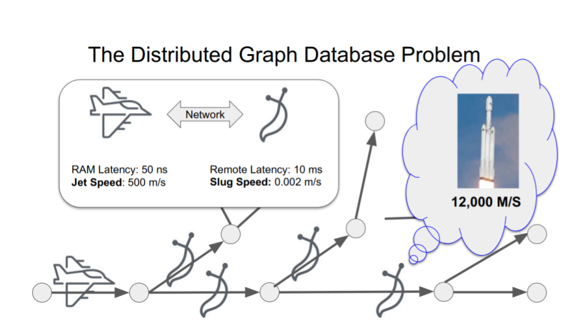
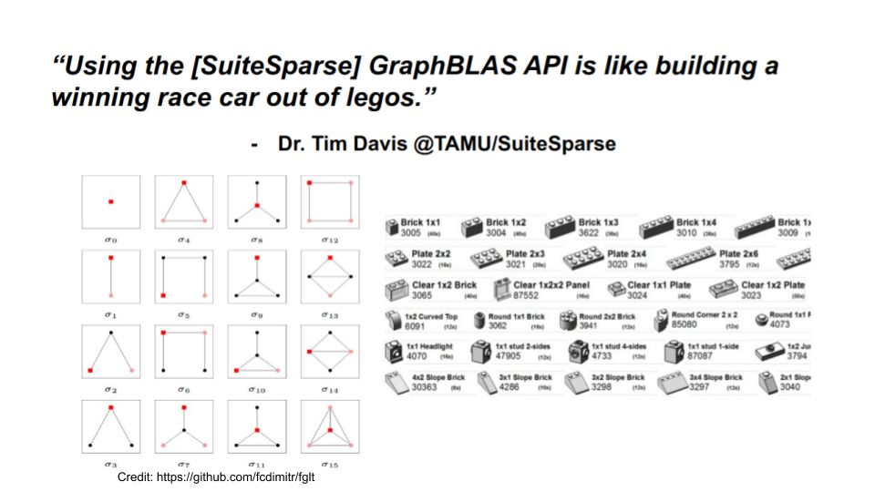

Bitcoin presents a particularly stubborn graph analysis problem:
transactions with multiple inputs, outputs and addresses can be
created at will by the network's users forming a very large sparse
[Hypergraph](https://en.wikipedia.org/wiki/Hypergraph) bundling
previous transaction outputs into new transaction inputs.

The Bitcoin hypergraph is extremely divergent, and has a high [Graph
Diameter](https://en.wikipedia.org/wiki/Distance_(graph_theory)).  As
bitcoin is (in a sense) indestructible, value flows forward in time
through many, many transactions on its way from one address to many
others, and each transaction along the way can branch into many
sub-paths.  Starting from one output and traversing the graph explodes
the number of transactions visited in order to search the blockchain.

**Graphegon CoinBLAS Community Edition** is a [Graph Linear
Algebra](https://en.wikipedia.org/wiki/Linear_algebra) analysis
platform for Bitcoin that uses the [GraphBLAS](https://graphblas.org)
graph API and the [Python](https://python.org/) programming language.

The GraphBLAS brings a powerful abstract mathematical language to
graph analysis that can be run on a very wide range of hardware from
phones to supercomputers. The design of the GraphBLAS is optimized to
take advantage of as much parallel hardware as is available with no
changes to the running code.  The combination of abstract
expressibility and heterogeneous scaling is what makes CoinBLAS a very
powerful tool for bitcoin graph analysis.

A key component of CoinBLAS is the
[SuiteSparse:GraphBLAS](https://people.engr.tamu.edu/davis/GraphBLAS.html)
implementation by Dr. Tim Davis of Texas A&M University.  Dr. Davis is
the world's leading expert hypersparse graph computing.  He is the
core author of the MATLAB sparse matrix and Python's scipy.sparse
libraries.  SuiteSparse represents the state of the art of decades of
parallel sparse matrix research and has recently acheived support for
Nvidia CUDA GPUs.

For the moment, CoinBLAS uses Google BigQuery to load blockchain data
into SuiteSparse binary graph data files.  Work is in progress to load
CoinBLAS graph data from a local bitcoin network node, although this
will eventually be the best way to run CoinBLAS, it will also be the
slowest as it requires loading all blocks the first time.  The
advantage of BigQuery is that it can parallel load any time range of
blocks for more focused analysis.

If you have enough RAM, Google BigQuery budget, cores and time you can
load all of bitcoin history into in-memory graphs and do full-graph,
full-flow analysis using simple, high level algebraic syntax.  This
can be expensive so make sure you know what you're getting into if you
decide to run a full CoinBLAS import locally.

# The GraphBLAS is Matrix Centric

The core concept of the GraphBLAS is the dualism that graphs and
matrices are mathematically interchangable: a matrix can represent a
graph, and a graph can represent a matrix.  Any graph can be converted
to a matrix and vice versa.  This mathematical isomorphism allows the
power of [Linear
Algebra](https://en.wikipedia.org/wiki/Linear_algebra) to be used to
analyze and manipulate graphs using [Matrix
Multiplication](https://en.wikipedia.org/wiki/Matrix_multiplication).

GraphBLAS matrices *only store the edges present in the graph* which
makes them [Sparse
Matricies](https://en.wikipedia.org/wiki/Sparse_matrix).  Vertices are
the rows and columns in the matrix, in a sense "coordinates" in a
(practically) infinite hyper edgespace.  You can map your vertex
addresses to whatever entities in your problem you want and then store
edges from source to destination vertices.

This is conceptually a big difference from most other graph processing
systems and languages which are typically Vertex (or Node) centric.
Usualling providing some API or query language where you can start
from a node, and traverse edges with various rules.  While the
GraphBLAS can work vertex at a time, it's true power lies in its
ability to work large chunks of the graph in parallel using a simple,
abstract, algebraic syntax.

# The Distributed Graph Database Problem

The vast majority of large scale graph analysis platforms take a
distributed "map reduce" approach.  Graph vertices are partitioned
horiziontally into a cluster of database nodes.  A replication factor
of one vertex per node means every step along the graph has a low
probability of being accessible localy in nanoseconds and a high
probabilty of being accessible remotely in millisecond.  These odds
and latencies get worse the bigger the cluster.



This "shuffling" can be avoided by replicating more vertices to more
nodes, but this explodes the cost of storage and taken to the extreme
of copying everything means nothing is distributed about it anymore,
it's just a pool of identical replicas.  Distributed graph
partitioning is always a lose-lose scenario, but you can trade off one
set of losses for another and there can be a whole dark art to it if
there is some exploitable structure in the data.

The GraphBLAS does not attempt to solve this problem, instead it
sidesteps it entirely: using the SuiteSparse:GraphBLAS library,
CoinBLAS stores the entire Bitcoin graph in RAM, optimally using
sparse and hypersparse matrix data structures and a library of
pre-compiled graph operations that take advantage of Linear Algebra's
powerful transformations.

For database-centric thinking, this may seem like a step backwards,
but for large scale forward thinking graph processing needs, it's an
immense liberation.  Database clusters are *obscenely* expensive.  You
must either pay a cloud cluster provider (like Citus Data) to provide
a pre-canned cluster or you have to hire at least one, and more like
2-3 full time cluster administrators.  Tack onto that the additional
markup the cloud provider like AWS is charging for the actual hardware
that the cluster provider passes onto you.

With CoinBLAS you can run it locally on your laptop for small scale
analysis, and then fire up a pay-by-the-second cloud node when you
need to do full-chain or all-graph analysis and tear it down when
you're done.  For less than $10K USD you can get a desktop workstation
with 64 CPU cores and 512GB of RAM.  This is the capacity equivalent
of an 8-node cluster of 8 CPUs and 64GB of RAM each, *but without the
remote access latency* or 3x cloud costs. Toss in a couple of GPUs and
you can do large scale parallel graph analysis with thousands of cores
locally on a single machine.

SuiteSparse data structures are specially optimized for concurrent
processing using CPUs and GPUs.  Most cloud providers today can offer
machines with multiple terabytes of RAM, hundreds of CPU cores, and
multiple GPUs with tens of thousands of cores.  CoinBLAS can run on a
laptop or a supercomputer thanks to the mathematical abstractions of
the GraphBLAS and can process billions of edges with no practical
upper limit.


Loading the full blockchain graph using CoinBLAS could take up to
512GB of memory and $1000 worth of BigQuery cost, so that's probably
out of most people's budgets.  However CoinBLAS can load a month's
worth of graph data at a time, costing only a few dollars per
data-month.  Current memory requirements to load all of November 2020
is 32GB of RAM and about $20 USD in BigQuery cost, easily done on
relatively modest laptop hardware.

# Matrix Multplication is Graph Traversal


The core operation of any graph algorithms is taking a "step" from a
vertex to its neighbors.  In the "Matrix View" of a graph, this
operation is Matrix Multiplication.  Therefore, repeated
multiplication on the same matrix *traverses* the graph in a [Breadth
First Search](https://en.wikipedia.org/wiki/Breadth-first_search).

Adjacency matrices can represent simple directed and undirected graphs
between identical kinds of things.  The bitcoin graph however is a
many to many combinations of inputs and outputs to transactions, the
inputs being the outputs of previous transactions.  Bitcoin is
actually a [Hypergraph](https://en.wikipedia.org/wiki/Hypergraph) and
can be constructed using two [Incidence
Matrices](https://en.wikipedia.org/wiki/Incidence_matrix)


Incidence however now requires two steps to get from one vertex to
another, but no worries, incidence matrices can be *projected* to an
adjacency matrix using, you guessed it, Matrix Multiplication:


# Blocktime Addressing of Blocks, Transactions and Outputs

The bitcoin blockchain is an immutable record of past transactions.
This immutability confers onto it a *total order* of blocks,
transactions and outputs.  This order is exploited by CoinBLAS by
storing the rows and columns of matrices *in the same immutable
order*.  For the purposes of CoinBLAS, this order is called
"Blocktime", not to be confused with the concept of how long it takes
for the network to produce new blocks.

Matrices are two dimensional and typically have dimensions denoted by
"M by N". Each value has an row and column index into the matrix
within the "keyspace" of *M by N*.  By convention in GraphBLAS these
indexes are called `I` and `J`.  The `I` index can be thought of as
the id of the start of the edge, and the `J` id of the end.  In
SuiteSparse these values are 60 bit unsigned integers.  The maximum
index is the extension constant `GxB_INDEX_MAX` which is 2 to the 60th
power (1152921504606846976) for SuiteSparse.

GraphBLAS has a cool trick where you can use the whole `2**60`
keyspace: because matrices are *sparse* they only allocate enough
memory to store their elements.  The MxN are just guardrails to keep
you from going "out of bounds" on your problem, but you can makes a
matrix that is effectively "unbounded" by setting M and N to
`GxB_INDEX_MAX`.  SuiteSparse won't allocate a zillion entries, it
won't allocate anything in fact until you put stuff in it.

In a sense, this turns a GraphBLAS matrix into an [Associative
Array](https://en.wikipedia.org/wiki/Associative_array) which was by
design, of course.


Using blocktime encoding causes the structure of the Input to Output
graph to have edges that always point towards the future.  Inputs can
only be outputs of previous transactions (or coinbase that come "from"
the block).  This forms a [Directed Acyclic
Graph](https://en.wikipedia.org/wiki/Directed_acyclic_graph) forms an
Upper [Triangular
Matrix](https://en.wikipedia.org/wiki/Triangular_matrix):


Now that we have a way of determining the order of blockchain events
and constructing directed graphs, we can define the entities that are
used to build up Matrix graphs in memory.  These "dimensions" are the
various types of conceptual vertices that can be related to each other.


Each of the above entites is used in the incidence matrices below.
These attributes of the `Chain` object are "lazy" and are only
computed if they are accessed.


Additional adjacency projections are provided as well:


By encoding the block number, transaction index, and output index into
the key used to store elements, CoinBLAS stores graphs in a linear
fashion, new blocks are always appended onto the "end" of the matrix.
Each block is a 2**32 "space" to fill with transactions and outputs,
whose ids are always between the start of the current block and the
start of the next.

This time linear construction defines a way of encoding the matrix
position of blocks, transactions, and outputs in "block time" so to
speak, lets see how to store the bitcoin graph as incidence matrices.
A bitcoin transcation can have multiple inputs and outputs.  The
inputs are the outputs of previous transactions.  So our incidence
matrices will map "Input to Transaction" on one side and "Transaction
to Output" on the other:


To give an idea of how the semiring works, consider a multi-party flow
show below.


# BFS

The core function of graph algorithms is the Breadth First Search.
This implementation of `Address.bfs_level` shows how to traverse the
graph breadth first, accumulating the step count as you go:

```python
    def bfs_level(self, depth=lib.GxB_INDEX_MAX):
        SR = self.chain.SR
        q = maximal_vector(INT64)
        pi = q.dup()
        q[self.id] = 0
        for level in range(min(depth + 1, SR.nvals)):
            with semiring.ANY_PAIR_INT64:
                q.vxm(SR, out=q, mask=pi, desc=descriptor.RSC)
            if not q:
                break
            pi.assign_scalar(level + 1, mask=q, desc=descriptor.S)
        return pi
```

Using the same trick but with a different semiring, the "BFS Tree" can
be constructed where every edge weight is the parent "back" to a
starting vertex.

```python
    def bfs_parent(self, depth=lib.GxB_INDEX_MAX):
        SR = self.chain.SR
        q = maximal_vector(INT64)
        pi = q.dup()
        q[self.id] = self.id
        for level in range(min(depth + 1, SR.nvals)):
            with semiring.ANY_SECONDI_INT64:
                q.vxm(SR, out=q, mask=pi, desc=descriptor.RSC)
            if not q:
                break
            pi.assign(q, mask=q, desc=descriptor.S)
        return pi
```

Finally, with yet another choice of semiring (MIN_MIN) the "exposure"
radiated foward by any address can be computed.

```python
    def bfs_exposure(self, depth=lib.GxB_INDEX_MAX):
        SR = self.chain.SR
        q = maximal_vector(INT64)
        pi = q.dup()
        q[self.id] = lib.GxB_INDEX_MAX
        for level in range(min(depth + 1, SR.nvals)):
            with semiring.MIN_MIN_INT64:
                q.vxm(SR, out=q, mask=pi, desc=descriptor.RSC)
            if not q:
                break
            pi.assign(q, mask=q, desc=descriptor.S)
        return pi
```

# Common Input Ownership

Any bitcoin user can make public key addresses at will, so in theory
it's hard to track back to the person who "owns" bitcoin.  However,
there are some heuristics for clustering objects and one of the most
used heuristics is called common-input-ownership.

To create a bitcoin transaction, a wallet looks for any unspent
transaction outputs to fit the transaction's value.  These inputs are
then used in the new transaction, publicly associating them with each
other as having a common owner.  Inputs of a feather spend together.

There's no end to structural and statistical techniques that can be
used to cluster addresses, but common-input-ownership is one we can
quickly demonstrate with CoinBLAS algebraically using the technique
described by [Reid and
Harrigan](https://users.encs.concordia.ca/~clark/biblio/bitcoin/Reid%202011.pdf)

	We construct an ancillary network in which each vertex represents a
	public-key. We connect these vertices with undirected edges, where each
	edge joins a pair of public keys that are both inputs to the same
	transaction (and are thus controlled by the same user).

We'll call this new relationship "SS" for Sender to Sender.  The
result we want in an adjacency matrix of sender with an edge to other
senders that it has shared inputs in transactions with.  We can
construct this adjacency by using the exising "ST" Sender to
Transaction graph and matrix multiplying it by it's transpose:


The "SS" matrix now contains a row and a column for every sender and
an edge from every sender to every other sender they have shared
transaction with as the sender.  The `PLUS_FIRST` semiring says to sum
common edges between any two senders but just using the left matrix,
since the values in the transpose of the matrix are redundant.

# The Future

CoinBLAS as it is today is just a starting point, a platform for
advanced analysis and computation with modern, high performance
hardware.  It provides a few building blocks of Bitcoin graph
structure to get started.  There is a whole world of complex analysis
out there, and the blocks provided by CoinBLAS and sparse matrix
linear algebra form the basis for an entire new way of thinking about
Graph analysis.

This is a fun diagram to get into thinking The GraphBLAS way.  On the
left is a diagram from a recent paper [Fast Graphlet Transform of
Sparse Graphs](https://arxiv.org/abs/2007.11111) and on the right are,
of course [Lego blocks](https://en.wikipedia.org/wiki/Lego).



The idea here is that complex graphs can be broken down into
orthogonal spectral components that describe the local structural
characteristics of graphs and subgraphs.  These spectral components
can then form the actual data inputs to more advanced deep and
statistical machine learning models.  This entire body of work has
been done in the language of Linear Algebra and represents an exciting
new way of doing component analysis on complex graphs.  Future
releases of CoinBLAS will include spectral analysis functions like
this.

# Usage

There are three modes of the program, initializing, importing, and
querying.  For initializing and importing, CoinBLAS needs a Google
Compute credientials file in the `GOOGLE_APPLICATION_CREDENTIALS`
environment variable.  **YOU WILL BE BILLED BY GOOGLE!**

Initializing downloads all the block meta information from BigQuery
and stores it in a local PostgreSQL database.  This will cost a few
dollars.

    ./coinblas.sh init

After initialization, you can choose the month or block ranges you
want to import from BigQuery.  This is a highly variable cost from a
few dollars for a single month to >$500 to import the whole chain.

    ./coinblas.sh --start-date '2014-01-01' --end-date '2014-05-01' --pool-size 8 import

Optionally, You can init and import *at the same time* by providing a
time range like import:

    ./coinblas.sh --start-date '2014-01-01' --end-date '2014-05-01' --pool-size 8 init

Importing uses the `multiprocessing` module to spawn `--pool-size`
BigQueries concurrently on month boundaries.  Because Google publishes
the Bitcoin blockchain partitioned by month, this reduces the amount
of data each parallel month import needs to scan.  It also means if
you have 100 cores, you can import 100 months in parallel provided you
have sufficient IO bandwith to write the binary files and commit the
postgresql data.

Once you've imported the data, CoinBLAS stores the graphs as
SuiteSparse binary files and you won't need to load the same blocks
again.  At the moment there are 3 files per block, so a full graph
load will save 1.5M files.  The directory layout is partitioned 256
ways on last two hex characters of the block's hash.

Once initialized and imported, the graphs can be loaded into memory
and queried through the Python API.  The PostgreSQL schema also
provides a simple SQL interface to the metadata for mapping numeric
ids to addresses and hashes.

    ./coinblas.sh --start-date '2014-01-01' --end-date '2014-05-01' --pool-size 8 query

# Python API

Under Construction!

It's worth pointing out that although CoinBLAS provides an object
oriented interface to Bitcoin, the intention is not to use these
objects to do graph analysis, that's what the GraphBLAS API functions
are for.  For example, you could start with an Address object and
iterate its output objects, but that would be slow and serialized and
involve lots of slow Python garbage collection.  A better approach is
to use the Addresses `sent_vector` attribute to create a GraphBLAS
Vector object of the sent input ids and then use that vector as an
input to an algebraic expression that computes the result you want.

These object types are instead meant to make working with the data as
inputs and outpus a bit easier than raw vectors and matrices.  So, use
these objects and their attributes to setup an analysis pass or get
the final result, but use the GraphBLAS itself for the actual number
crunching.

## Chain

The `Chain` object contains blocks and is the central object in
CoinBLAS.  It knows about all blocks after initialization, but only a
few of them may actually be imported into graph memory as you may only
be interested in the most recent blockchain history.

The chain has a summary method that tells you which blocks are
currently imported and their block and time span.

```
In [1]: print(btc.summary)

Blocks:
    - min: 654933
    - max: 659398

Transactions:
    - earliest: 0018107d14af3779528b2673af25a71278840ab42c2dca04ae2aa40e78983e75
        - time: Sun Nov  1 00:12:49 2020

    - latest: ffeebb98fa81aad157dfd30ef191642a8092f596d9e67d24ac0aa5c14b16da46
        - time: Mon Nov 30 23:58:59 2020

Total value:
    - in: 66674137.55322915 btc.
    - out: 66702050.05322915 btc.

Incidence Matrices:
    - BT:      9145550 Blocks to Txs.
    - IT:     26613475 Inputs to Tx.
    - TO:     26060065 Tx to Outputs.
    - SI:     26609128 Senders to Inputs.
    - OR:     26060181 Outputs to Receivers.
    - ST:     22569494 Senders to Transactions.
    - TR:     25893438 Transactions to Receivers.

Adjacencies:
    - IO:    127405068 edges Inputs to Outputs.
    - SR:    111390204 Senders to Receivers.
    - TT:     19917843 Tx to Tx.
```

## Block

The blocks in the chain are contained in the attribute `blocks`, which
is a dictionary that maps block number to Block objects.

    >>> b = btc.blocks[659398]
	>>> b
    <Block number: 659398>

Iterating a block iterates over the transactions in the block.

```python
	>>>	len(b)
	143
	>>> txs = list(chain.blocks[659398])
	>>> print(txs[0].summary)
	Tx: 001890dc59d2b1be406d64257886c6d6f23a5588263818b7d327cf9a6e73ce5d
	Block: 659398
	  Inputs:
		<Spend: [<Address: 3Q4bKhz912NLvjJ8UzizFDJbegDkKbGNAF>] value: 0.04798607>
		  \ from: 302097069cfe4d6b07c9809cfb57b354a1a08f9795529c4c4ef487fdb886b145
		<Spend: [<Address: 3Q4bKhz912NLvjJ8UzizFDJbegDkKbGNAF>] value: 0.01954829>
		  \ from: d26fecb98a44ac687442be2d2309337360af5e9033cd2fe15409e17d2d1308a2
	  Outputs:
		<Spend: [<Address: 1LVZDUYnaowWiR4TYQeTuTv94vf8MHwKHz>] value: 0.05299481>
		  \ spent: 1df733d17cb4a8a203032a58538738d3571692aae266f8024fb7e3cccd2f2aa1
		<Spend: [<Address: 3Q4bKhz912NLvjJ8UzizFDJbegDkKbGNAF>] value: 0.01419716>
		  \ spent: 17e0c7872d2dc79483190992ef93e3f80c7d48ac055dc4d89351ad4e738df4dd
```

- `initialize_blocks()`: This loads all the block metadata from BigQuery.

- `import_blocktime(start, end)`: Import block graph data from
  BigQuery for the specified date range.
  
- `load_blocktime(start, end)`: Load and merge imported block graph
  data into a single in memory graph between start and end time.
  
- `load_blockspan(start_block, end_block)`: Load and merge imported block graph
  data into a single in memory graph between start and end block numbers.

- `summary`: A text description of the currently loaded blockspan.

## Tx

A Tx wraps a transaction.

- id: The blocktime id of the transaction.

- hash: Tx hash

- block: Block object for Tx

- input_vector: Vector of inputs spend ids

- inputs: Generator of input Spend objects.

- output_vector: Vector of outputs spend ids.

- outputs: Generator of output Spend objects.

- summary: A text description of the transactions.

## Spend

A spend wraps a transaction output.  Since outputs are used as inputs
to subsequent transactions, the same object is also used for inputs.

- coinbase: Is this a coinbase input?

- tx: Transaction with this spend as output.

- spent_tx: Transaction with this spend as input or None if unspent.

- addresses: Addresses assocaited with this spend.


## Address

An Address wraps a bitcoin public key address.

- sent_vector: Vector of spend ids sent by this address into a transaction.

- received_vector: Vector of spend ids received by this address from a
  transaction.

- sent: Generator of Input Spends sent by this address into a transaction.

- received: Generator of Output Spends received by this address from a transaction.

- sender_tx_vector: Vector of transaction ids where this address is
  sender.

- receiver_tx_vector: Vector of transaction ids where this address is
  receiver.

- sender_txs: Generator of Tx objects where this address is sender.

- receiver_txs: Generator of Tx objects where this address is
  receiver.

Methods:

- `bfs_level(depth=GxB_INDEX_MAX)`: Do BFS search assigning hop
  distance from this address to adjacent address up to `depth`.

- `bfs_parent(depth=GxB_INDEX_MAX)`: Do BFS search assigning parent id
  to each vertext up to `depth`.

- `bfs_level(depth=GxB_INDEX_MAX)`: Do BFS search assigning value
  exposure to to each vertext up to `depth`.
