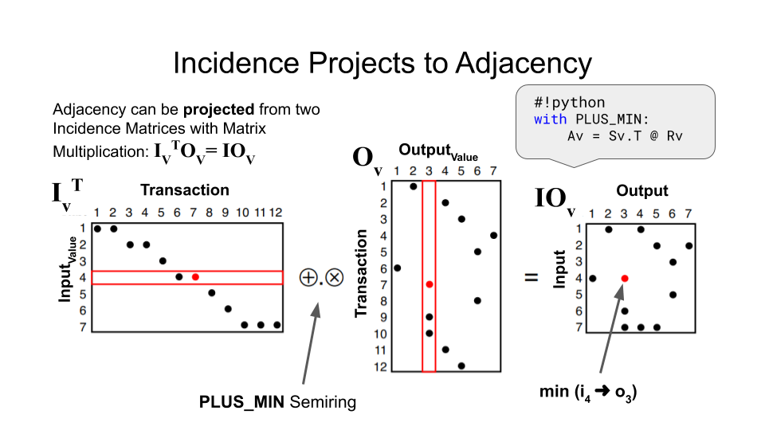

# CoinBLAS

# GraphBLAS all the Bitcoin

CoinBLAS is a Graph Linear Algebra analysis platform for bitcoin that
uses the GraphBLAS graph API via pygraphblas.

If you have enough RAM, BigQuery money, cores and time you can load
all of bitcoin history into in-memory graphs.

# Full-flow Analysis

All blockchains form a totally-ordered imutable transaction graph.
Value flows from party to party, block by block, forward in time,
branching and merging from destination addresses via transactions.
coinblas replicates this graph exactly in memory using GraphBLAS
matrices.

Transactions can be multi-sender and multi-receiver.

# The entire blockchain in RAM

Coinblas can do full-flow exposure analysis in real-time by storing
the entire blockchain in memory using the GraphBLAS's highly
space-efficient sparse matrix data formats.  Whole block-chain
analysis requires at least 512GB of ram and about $500 worth of
BigQuery spend to do a full parallel load.

# Incidence Matrices and Projections

CoinBLAS stores graph data as Incidence Matrices that get multiplied
to project different adjacencies in the graph.

## Block Transaction Projections

## Spend Transaction Projections

# The Gigabyte Epoch is Over

It's now relatively cheap to get cloud hardware with terabytes of
RAM.  Both Google and AWS provide several different large-memory
virtual machines with up to dozens of TB of RAM with the ability to
connect multiple GPUs as well, offering hundreds of GB of on-GPU RAM
for graph analytical processing using SuiteSparse:GraphBLAS.
