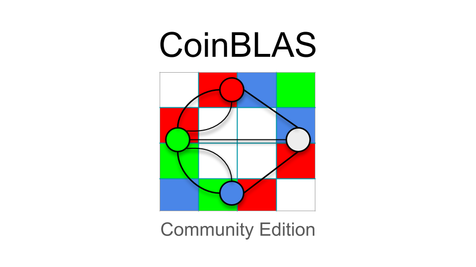
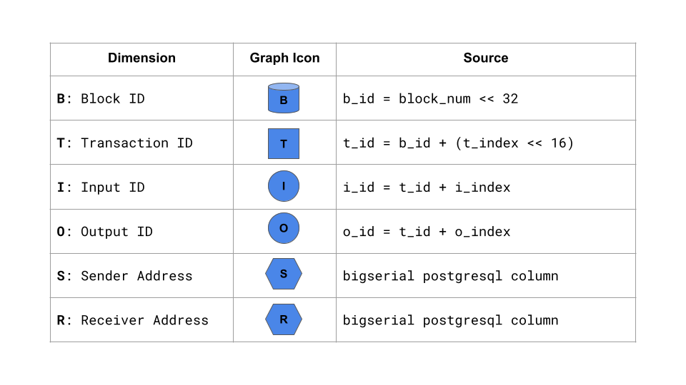

Bitcoin present a particularly stubborn graph analysis problem:
transactions can have many inputs and outputs, all of which can be
created at will by the network's users forming a very large sparse
[Hypergraph](https://en.wikipedia.org/wiki/Hypergraph) bundling
previous transaction outputs into new transaction inputs.

The Bitcoin hypergraph has an extremely high divergent [Graph
Diameter](https://en.wikipedia.org/wiki/Distance_(graph_theory)).
Value can flow forward in time through many, many transactions on its
way from one address to many others, and each transaction along the
way can branch into many sub-paths.  Starting from one output and
traversing the graph explodes the number of nodes visited in order to
search across the blockchain.

**Graphegon CoinBLAS Community Edition** is a [Graph Linear
Algebra](https://en.wikipedia.org/wiki/Linear_algebra) analysis
platform for Bitcoin that uses the [GraphBLAS](https://graphblas.org)
graph API and the [Python](https://python.org/) programming language.
CoinBLAS is as a framework for analyzing and solving graph problems
over the bitcoin hypergraph.

CoinBLAS uses Google BigQuery to load blockchain data.  If you have
enough RAM, Google BigQuery budget, cores and time you can load all of
bitcoin history into in-memory graphs and do full-graph, full-flow
analysis using simple, high level algebraic syntax.  This can be
expensive so make sure you know what you're getting into if you decide
to run CoinBLAS locally.

# The Entire Blockchain fits in RAM

The vast majority of large scale graph analysis platforms take a
distributed map reduce approach.  Graph vertices are partitioned
horiziontally into a cluster of database nodes.  A replication factor
of one vertex per node means every step along the graph has a low
probability of being stored localy (nanosecond access) and a high
probabilty of being stored remotely (millisecond access).  These odds
get worse the bigger the cluster.

This "shuffling" can be avoided by replicating more vertices to more
nodes, but this explodes the cost of storage and taken to the extreme
of copying everything means nothing is distributed about it anymore,
it's just a pool of identical replicas.  Distributed graph
partitioning is always a lose-lose scenario, but you can trade off one
set of losses for another and there can be a whole dark art to it if
there is some exploitable structure in the data.

Using the SuiteSparse:GraphBLAS library, CoinBLAS takes a different
approach: it stores the entire graph in RAM, optimally using sparse
and hypersparse matrix data structures and a library of pre-compiled
graph operations that take advantage of Linear Algebra's powerful
transformations.

SuiteSparse data structures are specially optimized for concurrent
processing using CPUs and GPUs.  Most cloud providers today can offer
machines with multiple terabytes of RAM, hundreds of CPU cores, and
multiple GPUs.  CoinBLAS can run on a laptop or a supercomputer thanks
to the mathematical abstractions of the GraphBLAS and can process
billions of edges with no practical upper limit.


Loading the full blockchain graph using CoinBLAS takes up to 512GB of
memory and $1000 worth of BigQuery cost, so that's probably out of
most people's budgets.  However CoinBLAS can load a month's worth of
graph data at a time, costing only a few dollars per data-month.
Current memory requirements to load all of November 2020 is 12GB of
RAM and about $20 USD in BigQuery cost, easily done on relatively
modest laptop hardware.

# Intro

The core concept of the GraphBLAS is the dualism that graphs and
matrices are mathematically interchangable: a matrix can represent a
graph, and a graph can represent a matrix.  Any graph can be converted
to a matrix and vice versa.  This mathematical communion allows the
power of [Linear
Algebra](https://en.wikipedia.org/wiki/Linear_algebra) to be used to
analyze and manipulate graphs using [Matrix
Multiplication](https://en.wikipedia.org/wiki/Matrix_multiplication).


The core operation of graph algorithms is taking a "step" from a node
to its neighbors.  Using Linear Algebra, this translates into the
common operation of Matrix Multiplication.  Looping and repeating
multiplications traverses the graph in a [Breadth First
Search](https://en.wikipedia.org/wiki/Breadth-first_search).

Adjacency matrices can represent simple directed and undirected graphs
between identical kinds of things.  The bitcoin graph however is a
many to many combinations of inputs and outputs to transactions, the
inputs being the outputs of previous transactions.  Bitcoin is
actually a [Hypergraph](https://en.wikipedia.org/wiki/Hypergraph) and
can be constructed using two [Incidence
Matrices](https://en.wikipedia.org/wiki/Incidence_matrix)


Incidence however now requires two steps to get from one node to
another, but no worries, to recover Adjacency, Incidence matrices can
be *projected* to an adjacency matrix using, you guessed it, Matrix
Multiplication:


The bitcoin blockchain is an immutable record of past transactions.
This immutability confers onto it a *total order* of blocks,
transactions and outputs.  This order is exploited by CoinBLAS by
storing the rows and columns of matrices *in the same immutable
order*.

Matrices are two dimensional and typically have dimensions denoted by
"M by N". Each value has an row and column index into the matrix
within the "keyspace" of *M by N*.  By convention in GraphBLAS these
indexes are called `I` and `J`.  The `I` index can be thought of as
the id of the start of the edge, and the `J` id of the end.  In
SuiteSparse these values are 60 bit unsigned integers.  The maximum
index is the extension constant `GxB_INDEX_MAX` which is 2 to the 60th
power (1152921504606846976) for SuiteSparse.

GraphBLAS has a cool trick where you can use the whole `2**60`
keyspace: because matrices are *sparse* they only allocate enough
memory to store their elements.  The MxN are just guardrails to keep
you from going "out of bounds" on your problem, but you can makes a
matrix that is effectively "unbounded" by setting M and N to
`GxB_INDEX_MAX`.  SuiteSparse won't allocate a zillion entries, it
won't allocate anything in fact until you put stuff in it.

In a sense, this turns a GraphBLAS matrix into an [Associative
Array](https://en.wikipedia.org/wiki/Associative_array) which was by
design, of course.


Using blocktime encoding causes the structure of the Input to Output
graph to have edges that always point towards the future.  Inputs can
only be outputs of previous transactions (or coinbase that come "from"
the block).  This forms a [Directed Acyclic
Graph](https://en.wikipedia.org/wiki/Directed_acyclic_graph) forms an
Upper [Triangular
Matrix](https://en.wikipedia.org/wiki/Triangular_matrix):


Now that we have a way of determining the order of blockchain events
and constructing directed graphs, we can define the entities that are
used to build up Matrix graphs in memory.  These "dimensions" are the
various types of conceptual nodes that can be related to each other.



Each of the above entites is used in the incidence matrices below.
These attributes of the `Chain` object are "lazy" and are only
computed if they are accessed.


Additional adjacency projections are provided as well:


By encoding the block number, transaction index, and output index into
the key used to store elements, CoinBLAS stores graphs in a linear
fashion, new blocks are always appended onto the "end" of the matrix.
Each block is a 2**32 "space" to fill with transactions and outputs,
whose ids are always between the start of the current block and the
start of the next.

This time linear construction defines a way of encoding the matrix
position of blocks, transactions, and outputs in "block time" so to
speak, lets see how to store the bitcoin graph as incidence matrices.
A bitcoin transcation can have multiple inputs and outputs.  The
inputs are the outputs of previous transactions.  So our incidence
matrices will map "Input to Transaction" on one side and "Transaction
to Output" on the other:


To give an idea of how the semiring works, consider a multi-party flow
show below.


# BFS

The core function of graph algorithms is the Breadth First Search.
This implementation of `Address.bfs_level` shows how to traverse the
graph breadth first, accumulating the step count as you go:

```python
    def bfs_level(self, depth=lib.GxB_INDEX_MAX):
        SR = self.chain.SR
        q = maximal_vector(INT64)
        pi = q.dup()
        q[self.id] = 0
        for level in range(min(depth + 1, SR.nvals)):
            with semiring.ANY_PAIR_INT64:
                q.vxm(SR, out=q, mask=pi, desc=descriptor.RSC)
            if not q:
                break
            pi.assign_scalar(level + 1, mask=q, desc=descriptor.S)
        return pi
```

Using the same trick but with a different semiring, the "BFS Tree" can
be constructed where every edge weight is the parent "back" to a
starting node.

```python
    def bfs_parent(self, depth=lib.GxB_INDEX_MAX):
        SR = self.chain.SR
        q = maximal_vector(INT64)
        pi = q.dup()
        q[self.id] = self.id
        for level in range(min(depth + 1, SR.nvals)):
            with semiring.ANY_SECONDI_INT64:
                q.vxm(SR, out=q, mask=pi, desc=descriptor.RSC)
            if not q:
                break
            pi.assign(q, mask=q, desc=descriptor.S)
        return pi
```

Finally, with yet another choice of semiring (MIN_MIN) the "exposure"
radiated foward by any address can be computed.

```python
    def bfs_exposure(self, depth=lib.GxB_INDEX_MAX):
        SR = self.chain.SR
        q = maximal_vector(INT64)
        pi = q.dup()
        q[self.id] = lib.GxB_INDEX_MAX
        for level in range(min(depth + 1, SR.nvals)):
            with semiring.MIN_MIN_INT64:
                q.vxm(SR, out=q, mask=pi, desc=descriptor.RSC)
            if not q:
                break
            pi.assign(q, mask=q, desc=descriptor.S)
        return pi
```

# Common Input Ownership

Any bitcoin user can make public key addresses at will, so in theory
it's hard to track back to the person who "owns" bitcoin.  However,
there are some heuristics for clustering objects and one of the most
used heuristics is called common-input-ownership.

To create a bitcoin transaction, a wallet looks for any unspent
transaction outputs to fit the transaction's value.  These inputs are
then used in the new transaction, publicly associating them with each
other as having a common owner.  Inputs of a feather spend together.

There's no end to structural and statistical techniques that can be
used to cluster addresses, but common-input-ownership is one we can
quickly demonstrate with CoinBLAS algebraically using the technique
described by [Reid and
Harrigan](https://users.encs.concordia.ca/~clark/biblio/bitcoin/Reid%202011.pdf)

	We construct an ancillary network in which each vertex represents a
	public-key. We connect these vertices with undirected edges, where each
	edge joins a pair of public keys that are both inputs to the same
	transaction (and are thus controlled by the same user).

We'll call this new relationship "SS" for Sender to Sender.  The
result we want in an adjacency matrix of sender with an edge to other
senders that it has shared inputs in transactions with.  We can
construct this adjacency by using the exising "ST" Sender to
Transaction graph and matrix multiplying it by it's transpose:


The "SS" matrix now contains a row and a column for every sender and
an edge from every sender to every other sender they have shared
transaction with as the sender.  The `PLUS_FIRST` semiring says to sum
common edges between any two senders but just using the left matrix,
since the values in the transpose of the matrix are redundant.

# Usage

There are three modes of the program, initializing, importing, and
querying.  For initializing and importing, CoinBLAS needs a Google
Compute credientials file in the `GOOGLE_APPLICATION_CREDENTIALS`
environment variable.  **YOU WILL BE BILLED BY GOOGLE!**

Initializing downloads all the block meta information from BigQuery
and stores it in a local PostgreSQL database.  This will cost a few
dollars.

    ./coinblas.sh init

After initialization, you can choose the month or block ranges you
want to import from BigQuery.  This is a highly variable cost from a
few dollars for a single month to >$500 to import the whole chain.

    ./coinblas.sh --start-date '2014-01-01' --end-date '2014-05-01' --pool-size 8 import

Optionally, You can init and import *at the same time* by providing a
time range like import:

    ./coinblas.sh --start-date '2014-01-01' --end-date '2014-05-01' --pool-size 8 init

Importing uses the `multiprocessing` module to spawn `--pool-size`
BigQueries concurrently on month boundaries.  Because Google publishes
the Bitcoin blockchain partitioned by month, this reduces the amount
of data each parallel month import needs to scan.  It also means if
you have 100 cores, you can import 100 months in parallel provided you
have sufficient IO bandwith to write the binary files and commit the
postgresql data.

Once you've imported the data, CoinBLAS stores the graphs as
SuiteSparse binary files and you won't need to load the same blocks
again.  At the moment there are 3 files per block, so a full graph
load will save 1.5M files.  The directory layout is partitioned 256
ways on last two hex characters of the block's hash.

Once initialized and imported, the graphs can be loaded into memory
and queried through the Python API.  The PostgreSQL schema also
provides a simple SQL interface to the metadata for mapping numeric
ids to addresses and hashes.

    ./coinblas.sh --start-date '2014-01-01' --end-date '2014-05-01' --pool-size 8 query

# Python API

Under Construction!

## Chain

The `Chain` object contains blocks and is the central object in
CoinBLAS.  It knows about all blocks after initialization, but only a
few of them may actually be imported into graph memory as you may only
be interested in the most recent blockchain history.

The chain has a summary method that tells you which blocks are
currently imported and their block and time span.

```
In [1]: print(btc.summary)

Blocks:
    - min: 654933
    - max: 659398

Transactions:
    - earliest: 0018107d14af3779528b2673af25a71278840ab42c2dca04ae2aa40e78983e75
        - time: Sun Nov  1 00:12:49 2020

    - latest: ffeebb98fa81aad157dfd30ef191642a8092f596d9e67d24ac0aa5c14b16da46
        - time: Mon Nov 30 23:58:59 2020

Total value:
    - in: 66674137.55322915 btc.
    - out: 66702050.05322915 btc.

Incidence Matrices:
    - BT:      9145550 Blocks to Txs.
    - IT:     26613475 Inputs to Tx.
    - TO:     26060065 Tx to Outputs.
    - SI:     26609128 Senders to Inputs.
    - OR:     26060181 Outputs to Receivers.
    - ST:     22569494 Senders to Transactions.
    - TR:     25893438 Transactions to Receivers.

Adjacencies:
    - IO:    127405068 edges Inputs to Outputs.
    - SR:    111390204 Senders to Receivers.
    - TT:     19917843 Tx to Tx.
```

## Block

The blocks in the chain are contained in the attribute `blocks`, which
is a dictionary that maps block number to Block objects.

    >>> b = btc.blocks[659398]
	>>> b
    <Block number: 659398>

Iterating a block iterates over the transactions in the block:

	>>>	len(b)
	143
	>>> txs = list(chain.blocks[659398])

## Tx

- id: The blocktime id of the transaction.

- hash: Tx hash

- block: Block object for Tx

- input_vector: Vector of inputs spend ids

- inputs: Generator of input Spend objects.

- output_vector: Vector of outputs spend ids.

- outputs: Generator of output Spend objects.

## Spend

- coinbase: Is this a coinbase input?

- tx: Transaction with this spend as output.

- addresses: Addresses assocaited with this spend.

- spent_tx: Transaction with this spend as input.


## Address

- sent: Input Spends sent by this address.

- received: Output Spends received by this address.

- sender_tx_vector: Vector of transaction ids where this address is
  sender.

- receiver_tx_vector: Vector of transaction ids where this address is
  receiver.

- sender_txs: Generator of Tx objects where this address is sender.

- receiver_txs: Generator of Tx objects where this address is
  receiver.

Methods:

- `bfs_level(depth=GxB_INDEX_MAX)`: Do BFS search assigning level to
  each vertext up to `depth`.

- `bfs_parent(depth=GxB_INDEX_MAX)`: Do BFS search assigning parent id
  to each vertext up to `depth`.

- `bfs_level(depth=GxB_INDEX_MAX)`: Do BFS search assigning value
  exposure to to each vertext up to `depth`.
