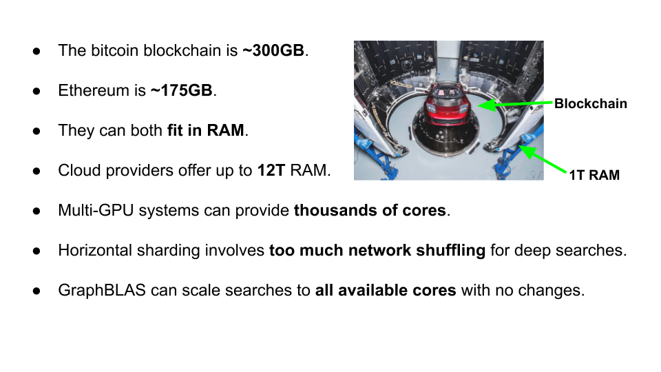

CoinBLAS is a Graph Linear Algebra analysis platform for bitcoin that
uses the GraphBLAS graph API via pygraphblas. If you have enough RAM,
BigQuery budget, cores and time you can load all of bitcoin history
into in-memory graphs.

# The entire blockchain in RAM

# Adjacency

# Incidence Matrices and Projections

## Blocktime IDs

## Block Transaction Incidence Flow

## Multi-party Incidence Flow

## Exposure Reduction

# The Gigabyte Epoch is Over

It's now relatively cheap to get cloud hardware with terabytes of
RAM.  Both Google and AWS provide several different large-memory
virtual machines with up to dozens of TB of RAM with the ability to
connect multiple GPUs as well, offering hundreds of GB of on-GPU RAM
for graph analytical processing using SuiteSparse:GraphBLAS.
