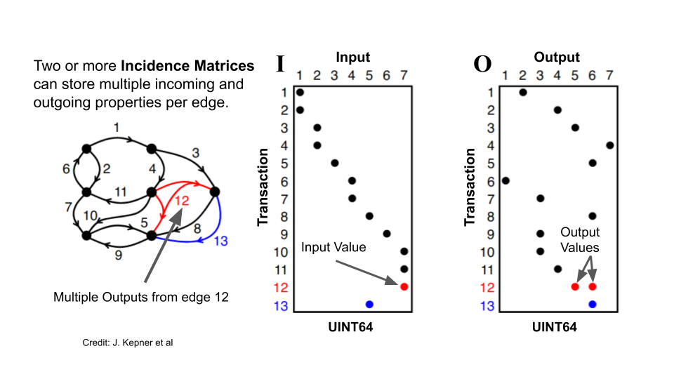

Bitcoin present a particularly stubborn graph analysis problem:
transactions can have many inputs and outputs, both of which can be
created at will by the network's users.  Starting from one output and
traversing the graph can explode the number of nodes that need to be
visited in order to search across the blockchain.  Following the flow
of value can be tricky when you consider that money can go flow back
and forth between two addresses.

CoinBLAS Community Edition is a Graph Linear Algebra analysis platform
for bitcoin that uses the GraphBLAS graph API via the pygraphblas
Python binding. If you have enough RAM, Google BigQuery budget, cores
and time you can load all of bitcoin history into in-memory graphs and
do full-graph, full-flow analysis using the GraphBLAS API.

Loading the full blockchain graph takes up to 512GB of memory and $500
worth of BigQuery cost, so that's probably out of most people's
budgets.  Thankfully, CoinBLAS can load a month's worth of graph data
at a time, costing only a few dollars per data-month.  Current memory
requirements to load all of November 2020 is 16GB of RAM, easily done
on relatively modest laptop hardware.

Once you've loaded the data, CoinBLAS stores the graphs as SuiteSparse
binary files.  At the moment there are 3 files per block, so a full
graph load will save 1.5M files.  The directory layout is partitioned
256 ways on last two hex characters of the block's hash.

# Intro

The next couple of sections serve as an introduction to Graph
algorithms with Linear Algebra that are used by CoinBLAS.  The core
concept of the GraphBLAS is that dualism that a graph can construct a
matrix, and a matrix can construct a graph.  This mathematical
communion allows the power of Linear Algebra to be used to analyze and
manipulate graphs.

The core operation of graph algorithms is taking a "step" from a node
to its neighbors.  Using Linear Algebra, this translates into common
operation of [Matrix
Multiplication](https://en.wikipedia.org/wiki/Matrix_multiplication).
Repeated multiplications traverse the graph in a [Breadth First
Search](https://en.wikipedia.org/wiki/Breadth-first_search).

Adjacency matrices however can only encode simple directed and
undirected graphs between similar kinds of things.  The bitcoin graph
however is a many to many combinations of inputs and outputs to
transactions, the inputs being the outputs of previous transactions.
No worry, Linear Algebra's got you there, the concept of a
[Hypergraph](https://en.wikipedia.org/wiki/Hypergraph) can be
constructed using two [Incidence
Matrices](https://en.wikipedia.org/wiki/Incidence_matrix)

Incidence matrices can be *projected* to an adjacency matrix using,
you guessed it, Matrix Multiplication:

The bitcoin blockchain is an immutable record of past transactions.
This immutability confers onto it a *total order* of blocks,
transactions and outputs.  This order is exploited by CoinBLAS by
storing the rows and columns of matrices *in the same immutable
order*.

Matrices are two dimensional and typically have dimensions denoted by
"M by N". Each value has an row and column index into the matrix
within the "keyspace" of *M by N*.  By convention in GraphBLAS these
indexes are called `I` and `J`.  The `I` index can be thought of as
the id of the start of the edge, and the `J` id of the end.  In
SuiteSparse these values are 60 bit unsigned integers.  The maximum
index is the extension constant `GxB_INDEX_MAX` which is 2 to the 60th
power (1152921504606846976) for SuiteSparse.

GraphBLAS has a cool trick where you can use the whole `2**60`
keyspace: because matrices are *sparse* they only allocate enough
memory to store their elements.  The MxN are just guardrails to keep
you from going "out of bounds" on your problem, but you can makes a
matrix that is effectively "unbounded" by setting M and N to
`GxB_INDEX_MAX'.  SuiteSparse won't allocate a zillion entries, it
won't allocate anything in fact until you put stuff in it.

In a sense, this turns a GraphBLAS matrix into an [Associative
Array](https://en.wikipedia.org/wiki/Associative_array) which was by
design, of course.

Now, by encoding the block, transaction index, and output index into
the index, CoinBLAS stores graphs in a linear fashion, new blocks are
always appended onto the "end" of the matrix.  Each block is a 2**32
"space" to fill with transactions and outputs, whose ids are always
between the start of the current block and the start of the next.

So now that we have a way of encoding the matrix position of blocks,
transactions, and outputs in "block time" so to speak, lets see how to
store the bitcoin graph as incidence matrices.  A bitcoin transcation
can have multiple inputs and outputs.  The inputs are (typically) the
outputs of previous transactions.  So our incidence matrices will map
"Input to Transaction" on one side and "Transaction to Output" on the
other:

Matrix multiplying `IT` and `TO` projects the adjacency matrix `IO`.
The values in the projection depend on the semiring being used.  In
this case, `PLUS_MIN` is used to take the minimum value between any
two input/output pairs of a transaction.  This gives the flow of
*exposure* from one address to another.

To give an idea of how the semiring works, consider a multi-party flow
show below.

Reduction...still working on you.

# Usage

There are three modes of the program, initializing, importing, and
querying.

Initializing downloads all the block meta information from BigQuery
and stores it in a local PostgreSQL database.  This will cost a few
dollars.

After initialization, you can choose the month or block ranges you
want to import from BigQuery.  This is a highly variable cost from a
few dollars for a single month to >$500 to import the whole chain.

Once initialized and imported, the graphs can be loaded into RAM and
queried through the Python API.  The PostgreSQL schema also provides a
simple SQL interface to the metadata for mapping numeric ids to
addresses and hashes.

